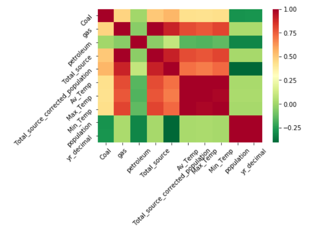
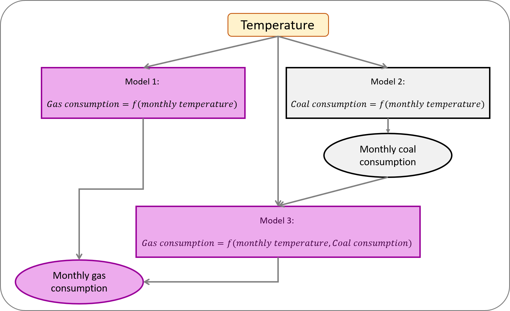
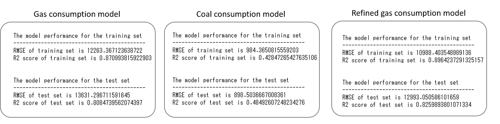
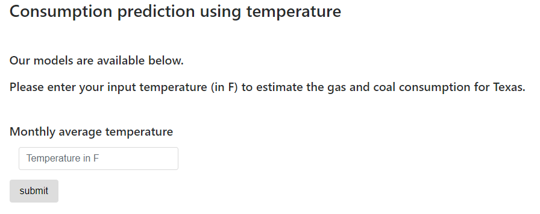

<h1>US Energy Consumption Analysis</h1>

<h2>Project Goal and Purpose:</h2
</h4>This project built on the previous Energy Consumption project to continuing on with data analysis of the different types of energy sources in the United States. We took our analysis further and applied predictive analysis using Machine Learning. 
In addition we used Tablaeu for more in depth visualization and trend analysis.

We created 3 Machine Learning models using Deep Learning to provide predictive analysis of Gas and Coal consumption using the key parameters of Temperature effect.
The Tablaeu visualization focused on showing the correlation between the Price of the different energy consumption sources in the residential, industrial and commercial sectors. Visualizations of the price variation for energy consumption across the various US States was created. 

Drilling down further to focus on the state of Texas we created visualizations of the effect of average temperature and population growth on Gas and Coal Consumption. Our Machine Learning was also focused on consumption prediction for the state of Texas.
</h4>

<h3>Questions:
  <ul>
  <li>Gas Consumption prediction as a function of Temperature and Coal</li>
  <li>Energy Consumption and Average Price by Sector and State in US</li>
  <li>Temperature correlation with Average Price by Sector</li>
  <li>Population growth and its afffect on energy consumption</li>
  <li>Historical sources of Energy consumption</li>
  <li>The Effect of Temperature on Gas Consumption</li>
  </ul>
</h3>
<br>
<h3>Data Visualization</h3>

<h5>Average electricity price by sector across US</h5>
We compared energy price in each sector in every state utilizing July 2018 and July 2019 data: 
<li>Hawaii has the highest energy cost in all sectors compare to any other states. For example, in residential sector, it costs 32.44 cents per kw vs. only 11.51 cents per kw in Texas </li>
<li>Energy costs are distributed evenly acorss sectors in Hawaii. In other words, there's not a significant variance in energy cost among residential, commerical or industrial sector. This is because Hawaii has very limited choice of energy sources. Every energey consumer needs to pay a hefty price to use energy.</li>
<li>Texas is a very business friendly state when it comes to energy price. For example, it costs only 5.81 cents per kw in Texas vs. 15.23 cents per kw in California for industrial sector customers </li>


<h5>Historical average electricity price in US by sector</h5>
<li>Electricity price had remained steady until 1970s when we experienced the first and second oil crisis. The electricity price increased more than 200% during the time period across all sectors.</li>
<li>After the oil crisis in 1970s, prices had been flat until late 2000s when we experienced another price spike. This time during financial crisis.</li>
<li>Residential electricity price costs almost two times more than industrial consumption.</li>


<h5>Average temperature from January thru December and the corresponding price per sector</h5>

We utilized yearly average temperature from 1976 to 2018 and compare the average electricty price in each sector:
<li>The energy price remains steady despite average temperature change month to month. This is because electricity prices are mainly contract based and does not correlate to temperature changes.</li>


<h5>Source of US electricity generation</h5>

We analyzed sources of electricity generation from 1950 thru 2018:

<li>Coal: Was increasing year over year unitl late 2000s. Since then, electricity generated by coal has been descreaing consistently.</li> 
<li>Natural Gas: Has been increasing year over year since 1980s and has surpassed coal as the major energy source in generating electricity.</li>
<li>Petroleum: Was one of the major energy sources, representing 17% in total electricity generation until late 1970s due to oil crisis. Since then, petroleum represents less than 1% in electricty generation.</li>
<li>Renewable: Has been increasing very slowing since late 2000s. In 2018, it represents 17% of total electricity generation and is expected to increase steadily.</li>
<li>Nuclear: Was increasing steadily from 1970s to 1980. Since then, electricity generated by nuclear has been very flat and we do not expect to see any drastic change from this energy source.</li> 
  
  


<h5>Population Growth and Coal Consumption</h5>

<li>Although Coal Consumption was on the increase untill the late 2000s. Since then, electricity generated by coal has been descreaing consistently. The visualization of coal consumption with population shows the current trend of decline in coal consumption despite a continuos increase in population growth. This alligns with the current emphasis on clean energy sources. 
</li> 


<h3>Machine Learning</h3>
We built a machine learning model to predict gas and coal consumption for Texas. <br>
We studied the correlation of our parameters to determine which variables have
impact on the gas and coal monthly consumption.



Petroleum, year and population are not correlated to gas and coal consumption. <br>
These parameters are dropped when building our models. <br>

We first focused on the average monthly temperature to build our models. <br>
<ul>
<li>Model 1: Model to predict gas consumption in function of monthly temperature</li>
<li>Model 2: Model to predict coal consumption in function of monthly temperature</li>
</ul><br>

Good correlation between gas and coal consumptions suggests that coal consumption can be used to
refine our model.<br>
We built additional model for gas consumption using temperature and coal consumption.<br>
<ul>
<li>Model 3: Model to predict gas consumption in function of monthly temperature and coal
consumption</li><br>
  


<h4>Model performance</h4>



## User interface to run the model




## Requirements
### Python
To run the app, you need to install flask, sqlAlchemy, sklearn and pickle.
<br>
### How to run
In terminal, <br>
``` conda activate PythonData``` <br>
then start the server by typing ```python app.py```<br>
Open the web browser and redirect to your server ```http://127.0.0.1:5000/```

### Heroku
A compiled version of the app can be found on [Heroku](https://www.heroku.com/home) at:
[https://prediction-gas-rice.herokuapp.com/machinelearning](https://prediction-gas-rice.herokuapp.com/machinelearning)


<h5>Team members:
    Mitsuko Kitazawa,
    Jessie Kuo,
    Mfon Udo-Imeh
</h5>
